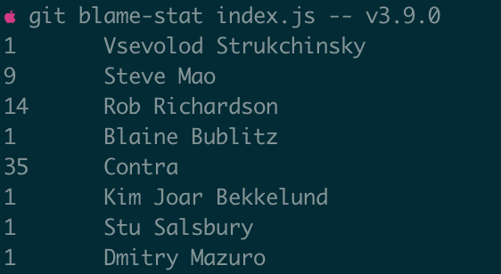
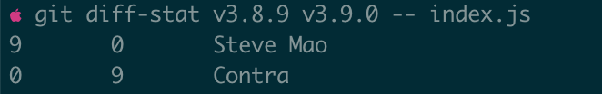
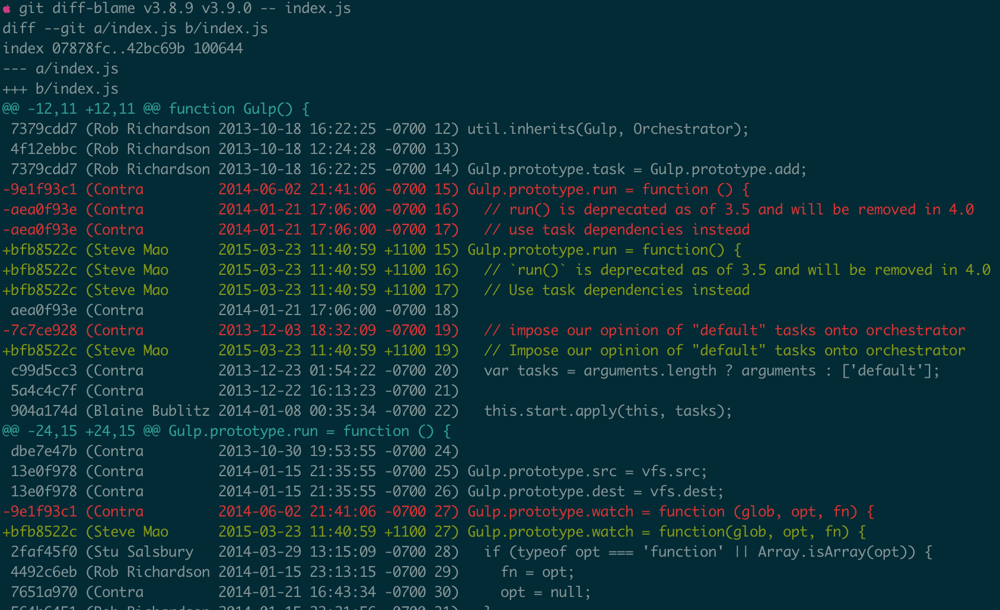

# git-utils

- [Installation](#installation)
- Commands
  - [git x](#git-x)
  - [git blame-stat](#git-blame-stat)
  - [git diff-stat](#git-diff-stat)
  - [git diff-blame](#git-diff-blame)

## Installation
```bash
git clone https://github.com/zoubin/git-utils.git
cd git-utils
echo "export PATH="'"'`pwd`"/bin:\$PATH"'"' >> ~/.bash_profile

```

## git x
Try to execute git subcommands in multiple repositories.

```bash
git x ./* -- pull
git x ./* -- checkout master
git x packages/* -- grep kewords -- src

```

## git blame-stat


## git diff-stat


## git diff-blame

